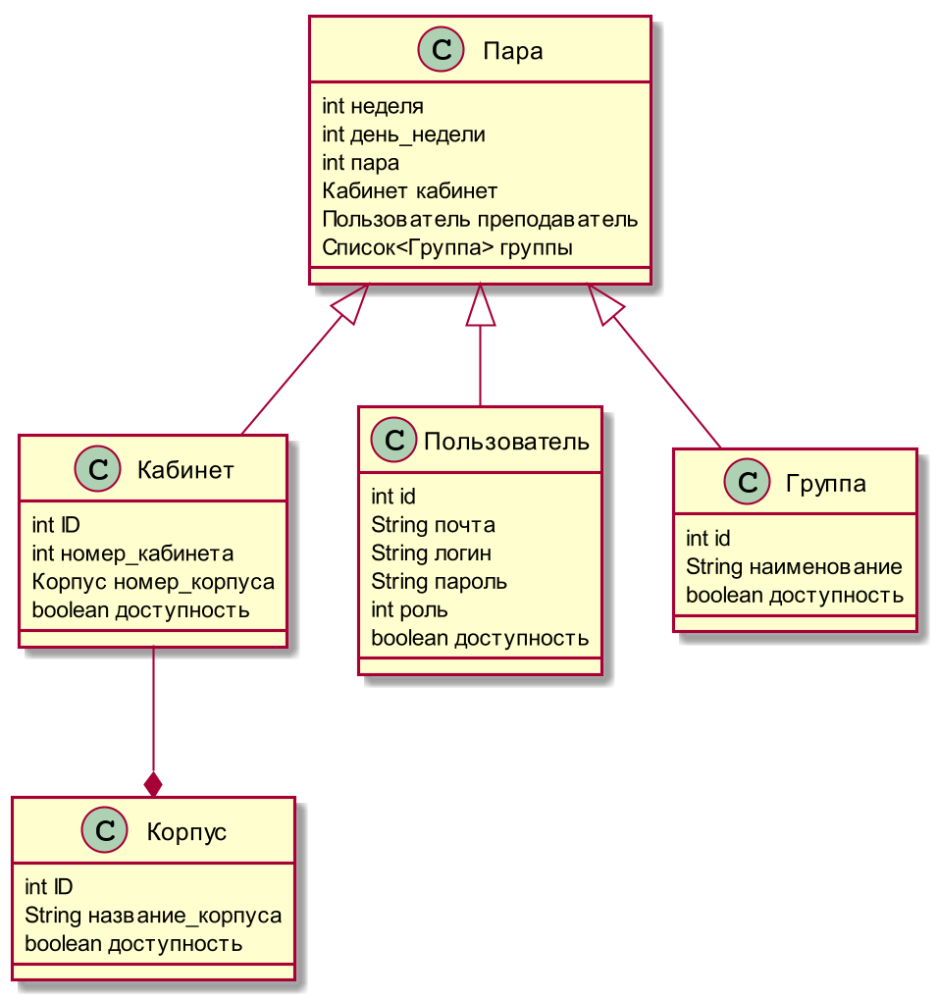
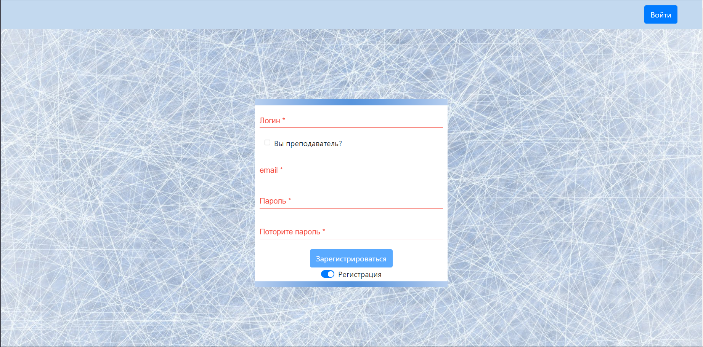

:noname:
:asciidoctor:
:filetype: PDF
:noheader:
:notitle:
:footer:
:doctype: article
:!sectnums:
:toc: macro 
:toc-title: Содержание

[width="100%" %autowidth.stretch, frame=none, grid=none, halign=center, valign=top, cols="^"]
|====================
|Министерство науки и высшего образования Российской Федерации
федеральное государственное бюджетное образовательное учреждение высшего образования «Рыбинский государственный авиационный технический университет имени П. А. Соловьева» 

Факультет радиоэлектроники и информатики
Кафедра вычислительных систем
||||||||||||
КУРСОВАЯ РАБОТА

по дисциплине: "Промышленная разрабоотка прилоежний на основе java технологий"

на тему: "Сервис по поиску свободных кабинетов"
|||||||||||||||
Студент гр ИВМ-19                   Каленов А. С. +
   гр ПИМ-19                     Головкин Д. М. +
Преподаватель                     Волков М. Л.
||||
|====================

[width="100%" %autowidth.stretch, frame=none, grid=none, halign=center, valign=top, cols="^"]
|====================
|Рыбинск 2020
|====================

<<<

toc::[]

<<<

:!sectnums:

=== Введение

   Многие предприятия используются программное обеспечение являющиеся специфическим и используется только на них. Из-за этого создается благоприятная среда для развития бизнеса по производству программного обеспечения.

   Среди многообразия языков программирования язык "Java" занимает позицию пусть и не самого высокопроизводительного языка, но самого безопасного и универсального.

   Целью данного курсового проекта является создание ВЕБ-приложения позволяющее посмотреть расписание университета для студента, преподавателяя и кабинета, а также дает возможность преподавателям  отменять и назначать пары

<<<

=== 1 Поставновка задачи

   Рассмотрим потребности целевой аудитории. Студентам нужно узнать расписание. Преподавателям узнать расписание и, возможно, изменить

[caption="Рисунок 1. ",title="Взаимодействие сервиса с клиентами"]
image::images/ditaa.png[]

<<<

=== 2 Разработка структуры классов

   Основной частью проекта является расписание, поэтому освновная структура хранимая в базе данных и будет это самое расписание, которое состоит из элементов типа "Пара".

   Пара из себя представляет встречу преподавателя и группы студентов в одном кабинете, что создает еще три класса "Кабинет", "Группа", "Преподаватель".

   Кабинеты объединяются в корпуса, а группы состоят из студентов. Студенты, преподаватели и администратор объединяем в "Пользователя".

   Как было ррассмотрено ранее, в приложении будет три роли : "Студент", "Преподаватель", "Администратор". Чтобы определить пользователя необходимо произвести вход в систему. Также необходима регистрация новых пользователей. Для этих целей создаем первую страничку. В итоге получаем структуру классов изображенную на рисунке 2.

[caption="Рисунок 2. ",title="Диаграмма классов"]

<<<

=== 3 Разработка фронтэнда

   Разработку клиентской части будем производить а основе технологии "Angular".

   Как было рассмотрено ранее, в приложении будет три роли: "Студент", "Преподаватель", "Администратор". Чтобы определить пользователя необходимо произвести вход в систему. Также необходима регистрация новых пользователей. Для этих целей создаем первую страничку.

[caption="Рисунок 3. ",title="форма входа"]
 

[caption="Рисунок 4. ",title="форма регистрации"]
 

   После отправки логина и пораля или данных форм регистрации от сервера идет ответ ссостоящий из логина и токена, эи данные хранятся в сессионом хранилище и позволяют получить доступ к рабочим местам пользователя. За защиту от несанкционированного доступа к этим страницам отвечает сервис AuthGuard. Если неопознанный пользователь попытается попасть на рабочее место, его отправит на страницу входа в систему.

   Далее рассмотрим макеты рабоочих мест администратора, студента и преподавателя. Студенту необходиом лишь отображение таблицы расписания с неоторыми фильтрами, преподавателю необходимо тоже самое и дополнительно пару кнопок "Создать пару" и "Отменить пару".

[caption="Рисунок 5. ",title="рабочее место преподавателя и студента"]
 

[caption="Рисунок 6. ",title="рабочее место администратора"]

[caption="Рисунок 7. ",title="рабочее место администратора"]

   В качестве элементтов, из которых собираем сттранницу берем элементыиз библиотеки mdb и дополнительно таблицы Agular DataTables. Данные элементы имеютт привлекатеельный внешний вид и дополнительные возможности, не предусмотренные в стандартных HTML компонентах.

<<<

=== 4 Разработка бэкэнда

   Серверная часть будет разрабатывается на языкке Java с использованием технологий Quarkus и Hibernate.

   Технология Quarkus позволяет с легкостью запустить REST сервис, который будет отвечать на запросы со стороны клиента. После старта REST сервис готов получать и отправлять запросы. Одним из первых запросов будет POST запрос ссодерржащий .xls файл, который содержит расписание. Далее на основании этого файла на серверной части создаются записи в базе даннных. В последствии эти записи сможет отредактировать администратор.

   Технология Hibernate позволит с легостью обмениваться данными с базой даннных. В нашем с лучае в базе даннных хранятся классы описанные ранее.

<<<

=== Заключение

   В процессе работы над данным курсовым проектом мы использоовали такие технологии как Angular, Hibernate, Quarkus. Написание пояснительной записки выполняли на языке разметки ASCIIDOC и в последующем конвертировали в файл .pdf.

<<<

[bibliography]
== Список использованных источников

1. Material Design for Bootstrap [Электронный ресурс]: Электрон., текстовые и граф. дан. – URL:	 
https://mdbootstrap.com/

2. ASCIIDOC User Manual [Электронный ресурс]: Электрон., текстовые и граф. дан. – URL: https://asciidoctor.org/docs/user-manual/#user-biblio

3. Angular Datatables [Электронный ресурс]: Электрон., текстовые и граф. дан. – URL: https://www.datatables.net/